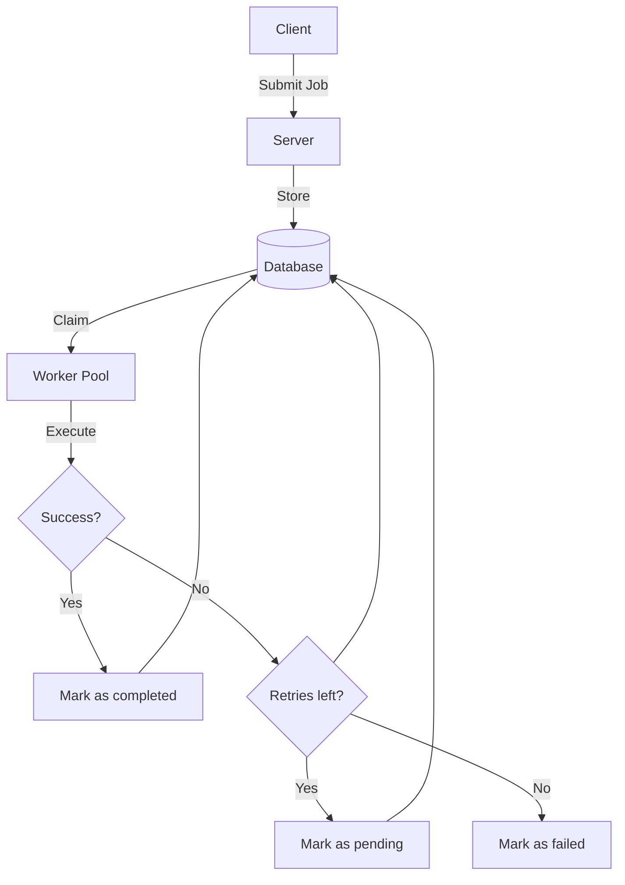

# Job Scheduler
A job scheduler system written in Rust for reliable background job processing with prioritization, retries, observability, lease-based execution, and process supervision.

## Architecture

## Features
### Implemented
- **📥 Job Submission API:** Submit Jobs via HTTP
- **💾 Durable job persistance:** Jobs are stored in database
- **⚡  Concurrent Workers:** Workers process jobs in parallel
- **🔼 Priority Scheduling:** High priority jobs are preferred
- **🔁 Retries & Backoff:** Exponential backoff for retrying jobs
- **🔐 Job Leasing:** Jobs are leased so stalled jobs can be reclaimed
- **🧹 Cleanup Task:** Moves failed jobs out of the primary queue
- **💀 Dead Letter Queue:** Persistent store for retry-exhausted jobs
- **🚪 Graceful Worker Shutdown:** Workers stop accepting new jobs and if in mid-execution, complete the current job until it reaches a terminal status (completed/failed) before shutting down
- **🧠 Worker Process Supervision:** A separate supervisor process spawns workers based on configuration, continuously monitors their exit status, and automatically respawns them if they crash.

### Planned Enhancements
- 🗓️ Scheduled jobs (One-time)
- 🔁 Periodic / Recurring jobs
- 📊 API to query job status & statistics
- 🖥️ Dashboard for real-time visualization
- 📈 Benchmarking & performance profiling

## Technologies
- **Server:** Rust (tokio, axum)
- **Worker:** Rust (tokio)
- **Database:** PostgreSQL (sqlx)

