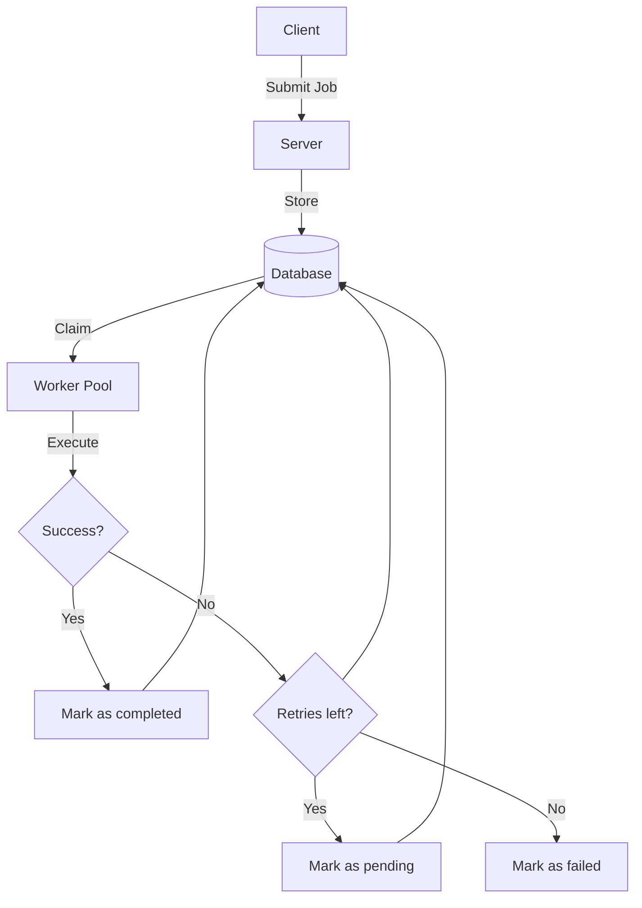

# Job Scheduler
A job scheduler system built in Rust for reliable background job processing.

## Architecture

## Technologies
- **Server:** Rust (tokio, axum)
- **Worker:** Rust (tokio)
- **Database:** PostgreSQL (sqlx)

## Current Implementation Status
**✅ Implemented:**
- Job submission via HTTP API
- Concurrent worker execution
- High priority jobs execute first
- Job status tracking (pending → running → completed)
- Retry counter and max_retries enforcement
- Observability (structured tracing/logs)
- Dead letter queue table (retry-exhausted jobs are moved from original jobs table to failed_jobs table)
- Job leased to worker for lease duration
- Job lease recovery once the lease expires to recover stalled jobs
- Cleanup task to move retry-exhausted jobs to failed jobs
- Exponential back-off between retries
- Worker graceful shutdown
- Worker process supervision with crash restart

**🚧 TODO:**
- Scheduled jobs
- Periodic/Recurring jobs
- Job query endpoints (GET /jobs/:id, GET /stats)
- Real-time dashboard to view workers, jobs & failed_jobs
- Benchmarking & Profiling

